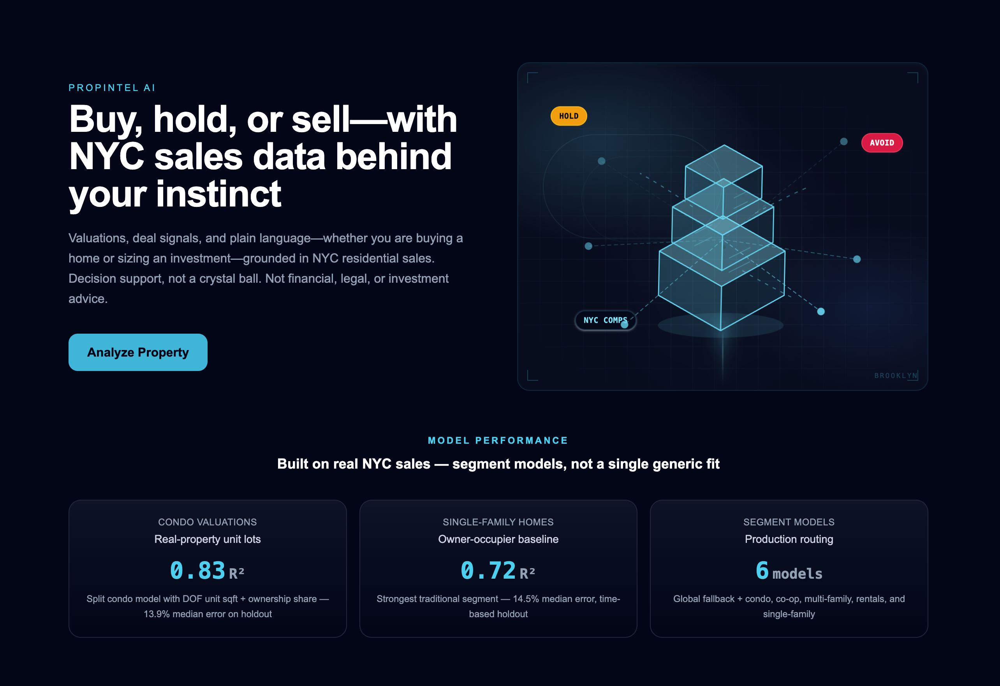

# PropIntel AI

PropIntel AI is an end-to-end AI engineering platform for NYC residential real estate investment analysis: a medallion-style data pipeline, segment-routed ML models, a production FastAPI backend, and a React frontend for valuation, scoring, explainability, and portfolio workflows.



### Core stack


### Data / AI stack


---

## Contents

- [Highlights](#highlights)
- [Product surface](#product-surface)
- [Contact form & email](#contact-form--email)
- [Billing & subscriptions (Stripe)](#billing--subscriptions-stripe)
- [System architecture](#system-architecture)
- [Medallion data pipeline](#medallion-data-pipeline)
- [API endpoints](#api-endpoints)
- [v2 prediction schema](#v2-prediction-request-schema)
- [Model registry & routing](#model-registry--subtype-routing)
- [Project structure](#project-structure)
- [Environment variables](#environment-setup)
- [Running locally](#running-the-app)
- [Database](#database-integration)
- [Testing & CI](#testing)
- [Docker & Railway](#docker--docker-compose)
- [Production checklist](#production--deployment-checklist)

---

## Highlights

- **Full stack:** React 19 + Vite + Tailwind CSS 4 frontend; FastAPI + Pydantic v2 backend; PostgreSQL via Supabase.
- **Auth:** Supabase Auth (email/password). API accepts **`Authorization: Bearer`** (JWT) or **`X-API-Key`** for scripts — unified `get_current_user` dependency.
- **Roles & LLM quota:** `user` / `paid` / `admin`; daily LLM limits enforced in the explainer; **`GET /auth/quota`** exposes usage.
- **Medallion pipeline:** Bronze → Silver normalisers → Gold as-of features → spine training with **strict time splits** and rolling-origin evaluation.
- **Segment-routed ML:** `ModelRegistry` maps building class → specialist spine models (one-family, multi-family, condo, co-op, rentals); optional **`bbl` + `as_of_date`** enriches from committed Gold parquets at inference time.
- **Quantile intervals:** P10/P90 quantile models per segment produce **property-specific price ranges**; segments without quantile artifacts fall back to a flat ±MAE band.
- **Confidence disclosure:** Per-segment **`model_confidence_tier`** (high / directional / fallback) surfaced in API metadata and the Analyze UI so users know when to trust a valuation.
- **Fast analysis UX:** **`POST /analyze-property-v2`** returns valuation + score immediately; LLM explanation fetched separately via **`POST /analyze-property-v2/explanation`** (no double inference).
- **Analysis:** Deterministic investment score, `deal_label`, OpenAI narrative (quota-aware), Mapbox geocoding (default **streets-v12** style) with org-wide monthly cap via **`POST /geocode/usage`**.
- **Contact:** Public **`POST /contact`** delivers visitor messages via **Resend** (no Supabase table required); **`/contact`** page + **`SupportLink`** component across legal/error/login flows.
- **Billing:** **Stripe Live** — hosted Checkout ($29/mo Pro), Customer Portal (cancel / payment method / invoices), webhooks sync **`profiles.role`** and **`billing_customers`**; Profile UI for upgrade and manage subscription.
- **Ops:** slowapi rate limits, CORS allowlist + optional **`CORS_ORIGIN_REGEX`** (Vercel previews), unified JSON errors with **`request_id`**, optional Sentry with PII scrubbing, **`/health`** + **`/ready`** (three-tier ML probe including a live inference call), JSON logs, security headers, proxy-aware IP when **`TRUST_PROXY_HEADERS=1`**.
- **Production (June 2026):** Frontend on **Vercel** (`www.propintel-ai.com`), API on **Railway** (`api.propintel-ai.com`), Supabase Auth + Postgres, secrets rotated and verified end-to-end (auth, LLM, email, Live billing).
- **Quality:** **126** backend pytest tests + **148** frontend Vitest tests (**274** total); CI includes **`test_model_column_parity.py`** (model/metadata feature parity) and GitHub Actions runs backend pytest, frontend **lint**, tests, and production build.

---

## Product surface

### Public routes

| Path | Purpose |
|------|---------|
| `/` | Marketing home |
| `/login`, `/register`, `/forgot-password`, `/reset-password` | Supabase Auth flows |
| `/terms`, `/privacy`, `/disclaimer` | Legal & valuation disclaimer |
| **`/contact`** | Contact form (support vs partnerships topics) — submits to **`POST /contact`** |

### Protected routes (valid Supabase session)

| Path | Purpose |
|------|---------|
| `/analyze` | Property analysis (Mapbox map, confidence badge, quantile range, quota pill, save to portfolio) |
| `/portfolio` | Saved analyses |
| `/profile` | Account, tier/quota, **Upgrade to Pro** / **Manage subscription** (Stripe) |
| `/billing/success`, `/billing/canceled` | Post-Checkout redirects |
| `/admin` | Admin dashboard (admin JWT or API key) |

### Support email UX

- **`SupportLink`** (`frontend/src/components/SupportLink.jsx`) centralises **`support@propintel-ai.com`** mailto links with optional subject/body — used in Footer-adjacent legal pages, error boundary, email verification banner, login (locked account), and profile (account deletion).
- **`/contact`** replaces mailto-only CTAs with a **form** so visitors without a desktop mail client can still reach you; routing is server-side by topic (see below).

---

## Contact form & email

### Behaviour

1. The browser **`POST`**s JSON to **`{VITE_API_BASE_URL}/contact`** (no auth).
2. FastAPI validates payload, applies **rate limiting** (**5 submissions / hour / IP**), and calls the **Resend** REST API.
3. Messages are delivered to Google Workspace inboxes:
   - **`topic: "support"`** → **`support@propintel-ai.com`**
   - **`topic: "partnerships"`** → **`marlon@propintel-ai.com`**
4. **`reply_to`** is set to the visitor’s email so **Reply** in Gmail goes directly to them.
5. **`CONTACT_FROM_EMAIL`** controls the visible **From** header (e.g. `PropIntel AI <noreply@propintel-ai.com>`); the address must be allowed in Resend for your verified domain.

### Backend env (Railway / local)

| Variable | Required | Purpose |
|----------|----------|---------|
| **`RESEND_API_KEY`** | Yes | Resend API key (sending scope). |
| **`CONTACT_FROM_EMAIL`** | Optional | Defaults in code to `PropIntel AI <noreply@propintel-ai.com>` if unset. |

### Related files

| Layer | Path |
|-------|------|
| API route | `backend/app/api/contact.py` |
| App wiring | `backend/app/main.py` (`contact_router`) |
| Validation JSON | `backend/app/core/error_handlers.py` (Pydantic v2 **`ctx.error`** safe for JSON) |
| Frontend page | `frontend/src/pages/Contact.jsx` |
| Frontend API | `frontend/src/services/contactApi.js` |
| Tests | `backend/tests/test_contact.py`, `frontend/src/__tests__/pages/Contact.test.jsx`, `frontend/src/__tests__/services/contactApi.test.js` |

### Dependencies

- **`httpx`** — async HTTP client to Resend (already in API requirements).
- **`email-validator`** + **`dnspython`** — required by Pydantic **`EmailStr`** on the contact schema; pinned in **`requirements.txt`** and **`requirements-api.txt`**.

---

## Billing & subscriptions (Stripe)

PropIntel AI Pro is **$29 USD/month** (Free tier: 10 LLM analyses/day; Pro: 200/day).

### Behaviour

1. Free users open **Profile → Upgrade with Stripe** → **`POST /billing/checkout`** returns a hosted Checkout URL.
2. After payment, Stripe redirects to **`/billing/success`**; webhooks set **`profiles.role`** to **`paid`** and upsert **`billing_customers`**.
3. Pro users use **Profile → Manage subscription** → **`POST /billing/portal`** → Stripe Customer Portal (cancel at period end, update card, invoices).
4. Cancellation webhooks revert role to **`user`** when the subscription ends (or per Stripe event handling in **`billing.py`**).

Card data never touches the API — Checkout and Portal are Stripe-hosted.

### Production URLs (Live)

| Item | Value |
|------|--------|
| Site | `https://www.propintel-ai.com` |
| API | `https://api.propintel-ai.com` |
| Webhook | `POST https://api.propintel-ai.com/billing/webhook` |
| Checkout success | `https://www.propintel-ai.com/billing/success` |
| Checkout cancel | `https://www.propintel-ai.com/billing/canceled` |
| Portal return | `https://www.propintel-ai.com/profile` |

### Backend env (Railway)

| Variable | Required | Purpose |
|----------|----------|---------|
| **`STRIPE_SECRET_KEY`** | Yes | `sk_live_...` (test: `sk_test_...` locally) |
| **`STRIPE_PRICE_PAID_MONTHLY`** | Yes | Live `price_...` for PropIntel AI Pro |
| **`STRIPE_WEBHOOK_SECRET`** | Yes | Live `whsec_...` from Dashboard webhook |
| **`STRIPE_AUTOMATIC_TAX`** | Optional | Set **`0`** at launch if not using Stripe Tax yet; default in code is `1` |
| **`BILLING_SUCCESS_URL`** | Recommended | Production success URL (see table above) |
| **`BILLING_CANCEL_URL`** | Recommended | Production cancel URL |
| **`BILLING_PORTAL_RETURN_URL`** | Recommended | Usually `/profile` on the live site |

### Supabase Auth email (Resend SMTP)

Auth emails (signup, password reset) use **Supabase → Authentication → Email → Custom SMTP** (`smtp.resend.com`, username `resend`, password = Resend API key). Contact form uses the same key via **`RESEND_API_KEY`** on Railway.

### Stripe Dashboard (Live)

- **Customer portal** enabled (cancellations, payment methods, invoices; plan switching off for single-plan launch).
- **Payout bank account** linked for **PropIntel AI LLC** (business checking); automatic daily payouts to your bank.
- **Test vs Live:** `billing_customers.stripe_customer_id` from Test mode does not work with Live API keys — reset test rows before Live checkout tests.

### Related files

| Layer | Path |
|-------|------|
| API | `backend/app/api/billing.py` |
| Migration | `backend/migrations/008_add_billing_tables.sql` |
| Frontend | `frontend/src/services/billingApi.js`, `frontend/src/pages/Profile.jsx`, `BillingSuccess` / `BillingCanceled` routes in `App.jsx` |

---

## System architecture

```text
        React Frontend (Vite + Tailwind CSS)
                      │
         Supabase Auth (email/password, JWT)
                      │
                      ▼
              FastAPI REST API
                      │
                      ▼
           Request Validation Layer
              (Pydantic v2 Schemas)
                      │
                      ▼
               API Routing Layer
              (FastAPI Endpoints)
                      │
                      ▼
              Service Layer
    ┌──────────────────────────────────────┐
    │  PredictionService                   │
    │  BblFeatureBuilder (as-of lookup)    │
    │  ModelRegistry (+ quantile bounds)   │
    │  Explainer (OpenAI LLM)             │
    └──────────────────────────────────────┘
                      │
              ┌───────┴────────┐
              ▼                ▼
        SQLAlchemy ORM    ML Inference
              │                │
              ▼                ▼
      PostgreSQL DB     Spine segment models
        (Supabase)      (LightGBM / XGBoost PKLs)
                               │
                               ▼
                     Gold Parquets (deploy) · Silver (optional local)
                     (DOF · ACRIS · J-51 · PLUTO)

        Contact form ──► POST /contact ──► Resend ──► Workspace inboxes

        Profile ──► POST /billing/checkout|portal ──► Stripe ──► webhooks ──► profiles + billing_customers
```

---

## Medallion data pipeline

```
Raw datasets (Bronze)
  NYC Rolling Sales · PLUTO · DOF Assessment · ACRIS · J-51 · Subway stations
            │
            ▼
  Silver normalisers  (ml/pipelines/silver_*.py)
            │
            ▼
  Spine builder  (ml/pipelines/spine_builder.py)
  training_spine_v1.parquet — BBL + sale_date + as_of_date (sale_date − 1 day)
            │
            ▼
  Gold as-of feature builders  (ml/pipelines/gold_*_asof.py)
  Condo unit features          (ml/pipelines/silver_dof_condo_units.py → gold_dof_condo_units.py)
            │
            ▼
  Training / tuning  (ml/models/train_spine_models.py, tune_spine_models.py)
            │
            ▼
  ml/artifacts/spine_models/   — median PKLs + P10/P90 quantile PKLs + stats + importances
```

---

## Data sources

| Dataset | Role |
|---------|------|
| NYC Rolling Sales | Transaction prices and attributes |
| NYC PLUTO | Parcel / geo / physical attributes |
| DOF Property Valuation & Assessment | Roll history for as-of features |
| ACRIS | Deed / mortgage history |
| J-51 | Exemption / abatement flags |
| NYC Subway Stations | Transit distance features |
| DOF PROPMAST (Tax Class 2/3/4) | Condo **unit-lot** sqft, common-interest %, apt no (manual download → Silver) |

Join key: **BBL**. As-of filters prevent future data from leaking into training rows. Condo unit structural features (sqft, ownership share) are time-invariant and joined by BBL only.

---

## Model registry & subtype routing

`ModelRegistry` maps **building class** → segment model (see `ml/artifacts/metadata/`). When promoted metadata exists, **`condo`** and **`coop`** replace the legacy pooled **`condo_coop`** route. Rental classes **`07`** and **`08`** share **`rentals_all`** with an **`is_elevator`** feature. Feature importances ship as CSV artifacts for explainability and LLM context.

At inference time, **`PredictionService`** derives input columns from the loaded model's preprocessor (`feature_names_in_`) to avoid train/serve skew. **`load_quantile_bounds()`** lazily loads `{segment}_p10_model.pkl` / `{segment}_p90_model.pkl` when present.

### Valuation intervals & confidence tiers

| Mechanism | What it does |
|-----------|--------------|
| **P10/P90 quantile models** | Property-specific price range when quantile artifacts exist (`one_family`, `multi_family`, `rentals_all` as of June 2026) |
| **±MAE fallback** | Flat band from segment training MAE when quantile models are absent (e.g. `global`, `condo`, `coop`) |
| **`model_confidence_tier`** | `high` / `directional` / `fallback` — tells the UI how much to trust the segment model |

| Building class (examples) | Model key |
|---------------------------|-----------|
| `01 ONE FAMILY DWELLINGS` | `one_family` |
| `02` / `03 TWO / THREE FAMILY` | `multi_family` (merged 2+3 unit) |
| `12` / `13` / `15` CONDOS | `condo` |
| `09` / `10` / `17` COOPS | `coop` |
| `07` / `08` RENTALS | `rentals_all` |
| Other / unknown | `global` (fallback) |

### Performance snapshot (time-based holdout)

Train ≤ **2024-12-31**, test ≥ **2025-01-31** (30-day reporting gap). Metrics from `ml/artifacts/metadata/*.json` and `ml/artifacts/spine_models/spine_model_metrics.json`:

| Segment | Test R² | Median APE | Quantile range | Notes |
|---------|---------|------------|----------------|-------|
| `condo` | **0.825** | **13.9%** | MAE fallback | Split from `condo_coop`; PROPMAST unit sqft + common-interest |
| `one_family` | **0.715** | **14.5%** | P10/P90 | LightGBM + VotingRegressor + early stopping (v4) |
| `multi_family` | **0.671** | **16.9%** | P10/P90 | Merged 2+3 family; comp/trend packs |
| `coop` | **0.501** | **24.4%** | MAE fallback | Co-op shares — no public unit-level data |
| `rentals_all` | **0.467** | **26.2%** | P10/P90 | Pooled rentals; **price per unit** target |

Legacy pooled **`condo_coop`** metadata may remain for older deploys; production routes to **`condo`** / **`coop`** when split metadata is present.

---

## API endpoints

### Health

| Method | Path | Purpose |
|--------|------|---------|
| `GET` | `/health` | Liveness |
| `GET` | `/ready` | DB reachable + ML artifacts on disk + **live inference probe** (**503** if degraded) |

### Public (no JWT)

| Method | Path | Purpose |
|--------|------|---------|
| **`POST`** | **`/contact`** | Contact form → Resend (**rate limited**) |

### Auth (JWT or `X-API-Key`)

| Method | Path | Purpose |
|--------|------|---------|
| `GET` | `/auth/me` | Profile (creates row on first hit) |
| `PATCH` | `/auth/me` | Update profile |
| `GET` | `/auth/quota` | LLM quota status |

### Billing

| Method | Path | Purpose |
|--------|------|---------|
| `POST` | `/billing/checkout` | JWT — Stripe Checkout Session URL |
| `POST` | `/billing/portal` | JWT — Customer Portal URL |
| `GET` | `/billing/status` | JWT — subscription mirror + effective role |
| `POST` | `/billing/webhook` | Stripe signature — lifecycle events (**no JWT**) |

### Geocode usage

| Method | Path | Purpose |
|--------|------|---------|
| `POST` | `/geocode/usage` | Record Mapbox request; **429** over monthly cap |

### Properties

| Method | Path | Purpose |
|--------|------|---------|
| `POST` | `/properties/` | Create |
| `GET` | `/properties/` | List / filter |
| `GET` | `/properties/{id}` | Read |
| `PATCH` | `/properties/{id}` | Update |
| `DELETE` | `/properties/{id}` | Delete |
| `GET` | `/housing/lookup` | Nearest housing row for autocomplete |

### Prediction & analysis (v2)

| Method | Path | Purpose |
|--------|------|---------|
| `POST` | `/predict-price-v2` | Valuation only |
| `POST` | `/analyze-property-v2` | Fast analysis (valuation + score; explanation pending) |
| `POST` | `/analyze-property-v2/explanation` | LLM explanation for a completed analysis |
| `GET` | `/model/feature-importance` | Global importances |

Legacy v1 routes (`/predict-price`, `/analyze-property`, `/predict`, `/analyze`) were **removed** — all clients should use v2.

### Admin

| Method | Path | Purpose |
|--------|------|---------|
| `GET` | `/admin/overview` | Aggregate stats |
| `PATCH` | `/admin/users/{user_id}/role` | Set role |

OpenAPI **`/docs`**, **`/redoc`**, **`/openapi.json`** are gated by **`DOCS_ENABLED=1`** (keep off in production).

---

## v2 prediction request schema

### `POST /predict-price-v2`

```json
{
  "borough": "Brooklyn",
  "neighborhood": "Park Slope",
  "building_class": "02 TWO FAMILY DWELLINGS",
  "year_built": 1925,
  "gross_sqft": 1800,
  "land_sqft": 2000,
  "latitude": 40.6720,
  "longitude": -73.9778,
  "bbl": "3012340056",
  "as_of_date": "2025-06-15"
}
```

Optional **`bbl`** + **`as_of_date`** enable roll-aligned enrichment when Gold/Silver data is available.

### `POST /analyze-property-v2`

Same fields plus optional **`market_price`** for listing comparison.

---

## Example `POST /analyze-property-v2` response

```json
{
  "valuation": {
    "predicted_price": 1185000.0,
    "market_price": 1250000.0,
    "price_difference": -65000.0,
    "price_difference_pct": -5.2,
    "price_low": 980000.0,
    "price_high": 1420000.0,
    "valuation_interval_note": "P10–P90 quantile range: calibrated to this property's segment and location. Tighter bands indicate more data support; wider bands reflect higher price uncertainty."
  },
  "investment_analysis": {
    "roi_estimate": -5.2,
    "investment_score": 38,
    "deal_label": "Avoid",
    "recommendation": "Approach cautiously and negotiate closer to model-estimated value.",
    "confidence": "Medium",
    "analysis_summary": "Property may be overpriced by approximately $65,000 based on model analysis."
  },
  "drivers": { "top_drivers": [], "global_context": [], "explanation_factors": [] },
  "explanation": {
    "summary": "…",
    "opportunity": "…",
    "risks": "…",
    "recommendation": "Avoid",
    "confidence": "Medium"
  },
  "explanation_status": "pending",
  "metadata": {
    "model_version": "v4",
    "segment": "multi_family",
    "segment_label": "Multi-family",
    "model_confidence_tier": "high",
    "model_confidence_label": "High confidence",
    "model_confidence_note": "This segment model is trained on sufficient NYC sales data for this building type. Typical median error for this segment: ~16.9%."
  }
}
```

---

## Project structure

```
propintel-ai/
├── frontend/                    # React 19 + Vite + Tailwind CSS 4
│   ├── src/
│   │   ├── pages/               # Home, Analyze, Portfolio, Profile, Auth, Legal, Contact, …
│   │   ├── components/          # Navbar, Footer, SupportLink, ModelConfidence*, …
│   │   ├── services/            # authApi, contactApi, housingApi, …
│   │   └── lib/                 # apiClient, supabase
│   ├── public/
│   ├── vercel.json              # SPA rewrites for React Router
│   └── package.json
│
├── backend/app/
│   ├── api/
│   │   ├── prediction.py
│   │   ├── properties.py
│   │   ├── auth_router.py
│   │   ├── admin.py
│   │   ├── geocode_usage.py
│   │   ├── contact.py           # POST /contact → Resend
│   │   └── billing.py           # Stripe Checkout, Portal, webhooks
│   ├── core/                    # auth, limiter, error_handlers, config
│   ├── db/
│   ├── schemas/
│   ├── services/                # predictor, model_registry, model_confidence, explainer, …
│   └── main.py
│
├── backend/scripts/run_migrations.py
├── backend/migrations/          # SQL migrations + schema_migrations
├── backend/tests/               # e.g. test_contact.py
│
├── tests/                       # Main pytest suite (API, auth, quota, model parity, …)
│
├── docs/                        # Preview screenshots; internal notes gitignored locally
├── ml/                          # Pipelines, training, artifacts (see repo)
├── Dockerfile
├── docker-compose.yml
├── railway.toml
├── requirements.txt             # Full dev + ML stack
├── requirements-api.txt         # Slim API Docker image
└── .env.example
```

---

## Environment setup

### Backend

```bash
python3 -m venv .venv
source .venv/bin/activate
pip install -r requirements.txt
```

Copy **`.env.example`** → **`.env`** at the repo root. Use **`postgresql+psycopg://`** for **`DATABASE_URL`** (matches `psycopg` v3).

**Docker / API-only installs:** add any new **runtime** import used by `backend/app/` to **`requirements-api.txt`** with the same pin as **`requirements.txt`** when applicable.

| Variable | Purpose |
|----------|---------|
| `DATABASE_URL` | Postgres (Supabase pooler OK) |
| `OPENAI_API_KEY` | LLM explanations |
| `API_KEY` | `X-API-Key` for scripts |
| `CORS_ORIGINS` | Exact browser origins (include both `localhost` and `127.0.0.1` dev ports if needed) |
| `CORS_ORIGIN_REGEX` | Optional (e.g. Vercel previews); default in code matches `propintel-*.vercel.app` |
| `SUPABASE_URL` | JWKS host for asymmetric JWTs |
| `SUPABASE_JWT_SECRET` | HS256 verification |
| `ADMIN_USER_IDS` | Comma-separated admin UUIDs |
| **`RESEND_API_KEY`** | **Contact form + can match Supabase SMTP usage operationally** |
| **`CONTACT_FROM_EMAIL`** | **Verified sender string for `/contact`** |
| `LLM_QUOTA_*`, `LLM_TEMPERATURE` | Quotas / sampling |
| `MAPBOX_MONTHLY_FREE_REQUEST_CAP` | Geocode cap checks |
| `DOCS_ENABLED` | `1` = expose `/docs` |
| `LOG_LEVEL` | Log verbosity |
| `SENTRY_*` | Optional observability |
| `TRUST_PROXY_HEADERS` | `1` behind trusted reverse proxy only |
| **`STRIPE_SECRET_KEY`** | Stripe API (Live on Railway) |
| **`STRIPE_PRICE_PAID_MONTHLY`** | Pro monthly `price_...` |
| **`STRIPE_WEBHOOK_SECRET`** | Webhook signature verification |
| **`STRIPE_AUTOMATIC_TAX`** | `0` or `1` — launch used **`0`** |
| **`BILLING_SUCCESS_URL`**, **`BILLING_CANCEL_URL`**, **`BILLING_PORTAL_RETURN_URL`** | Checkout / Portal redirects |
| `ML_ARTIFACT_ROOT` | Override artifact root |
| `DB_POOL_SIZE`, `DB_MAX_OVERFLOW` | Pool tuning |
| `RUN_MIGRATIONS` | Docker: skip migrations if `0` |

### Frontend

```bash
cd frontend && npm install
```

Copy **`frontend/.env.example`** → **`frontend/.env`**. **`VITE_*`** are inlined at **build** time.

| Variable | Purpose |
|----------|---------|
| **`VITE_API_BASE_URL`** | FastAPI origin (**required** for `apiFetch` and `/contact`) |
| `VITE_SUPABASE_URL` | Supabase project URL |
| `VITE_SUPABASE_ANON_KEY` | Anon key |
| `VITE_MAPBOX_TOKEN` | Mapbox public token |
| `VITE_MAPBOX_STYLE` | Optional map style override |
| `VITE_API_KEY` | Optional; must match server `API_KEY` (ships in bundle — not a secret) |

**Staging:** `frontend/.env.staging` + **`npm run dev:staging`** (see comments in `.env.example`).

---

## Running the app

### Backend

```bash
uvicorn backend.app.main:app --reload
```

- API: `http://127.0.0.1:8000`
- Swagger: `http://127.0.0.1:8000/docs` when **`DOCS_ENABLED=1`**
- Health: `/health`, readiness: `/ready`

### Frontend

```bash
cd frontend && npm run dev
```

Default dev server: `http://localhost:5174` (match **`CORS_ORIGINS`**).

### Database migrations

- Local SQLite / CI: `python -m backend.app.db.init_db`
- Postgres: `python -m backend.scripts.run_migrations` (also optional on Docker boot unless **`RUN_MIGRATIONS=0`**)

---

## Database integration

| Table | Model | Role |
|-------|-------|------|
| `profiles` | `Profile` | User profile + role |
| `properties` | `Property` | Saved analyses (`analysis` JSONB) |
| `llm_usage` | `LLMUsage` | Daily LLM counts |
| `mapbox_usage` | `MapboxUsage` | Geocode usage reporting |
| `housing_data` | `HousingData` | Reference / lookup data |
| **`billing_customers`** | **`BillingCustomer`** | Stripe customer + subscription mirror per user |
| **`billing_events`** | **`BillingEvent`** | Append-only webhook event log |

Contact submissions are **not** persisted in Postgres by default.

---

## Testing

### Backend

```bash
PYTHONPATH=. pytest
```

From the repo root this discovers **`tests/`** and **`backend/tests/`** (**126** tests), including **`tests/test_model_column_parity.py`** (model vs metadata feature parity), **`tests/test_model_confidence.py`**, and **`backend/tests/test_contact.py`**.

### Frontend

```bash
cd frontend && npm test
```

**148** tests (Vitest + Testing Library). **`npm run lint`** runs ESLint (also executed in CI).

### Totals

| Suite | Count |
|-------|------:|
| Backend (`pytest`) | 126 |
| Frontend (`npm test`) | 148 |
| **Total** | **274** |

### CI

Workflow: **`.github/workflows/tests.yml`**

- **Backend:** Python 3.11, install **`requirements.txt`**, init SQLite DB, **`PYTHONPATH=. pytest`**
- **Frontend:** **`npm ci`**, **`npm run lint`**, **`npm test`**, **`npm run build`**

---

## Docker & Docker Compose

```bash
docker build -t propintel-ai:latest .
docker run --rm -p 8000:8000 --env-file .env propintel-ai:latest
# or: docker compose up --build
```

**`.dockerignore`** keeps Silver/raw bulk and the training-only **`training_spine_v1.parquet`** out of the image; **`ml/artifacts/spine_models/`** (median + quantile PKLs) and Gold parquets needed for inference are included. The Dockerfile installs **`libgomp1`** (GNU OpenMP) required by XGBoost/LightGBM on `python:*-slim`.

- **`PORT`** — Railway / container port.
- **`DATABASE_URL`** — must use **`postgresql+psycopg://`** inside the container.

---

## Production & deployment checklist

### Live stack (verified June 2026)

| Layer | Host | URL |
|-------|------|-----|
| Frontend | Vercel | `https://www.propintel-ai.com` |
| API | Railway | `https://api.propintel-ai.com` |
| Database + Auth | Supabase | Postgres pooler + JWT signing keys (ES256) |
| Email | Resend | Contact API + Supabase SMTP (`noreply@propintel-ai.com`) |
| Payments | Stripe Live | Checkout, Portal, webhooks → `paid` role |

### Pre-launch / rotation checklist

| Area | Notes |
|------|--------|
| **Database** | Run migrations (`008_add_billing_tables.sql` via `run_migrations` or `RUN_MIGRATIONS` on deploy) |
| **API (Railway)** | `DATABASE_URL`, `SUPABASE_URL`, `SUPABASE_JWT_SECRET` (HS256 fallback), `OPENAI_API_KEY`, `API_KEY`, `RESEND_API_KEY`, `CONTACT_FROM_EMAIL`, Stripe vars, **`CORS_ORIGINS`** = `https://www.propintel-ai.com,https://propintel-ai.com`, **`TRUST_PROXY_HEADERS=1`** |
| **Auth** | Rotate JWT **signing keys** in Supabase (standby → rotate → revoke previous); keep **`SUPABASE_URL`** on Railway for JWKS |
| **Email** | Resend domain verified; Supabase SMTP password = same `re_...` key as **`RESEND_API_KEY`** |
| **Frontend (Vercel)** | `VITE_API_BASE_URL`, `VITE_SUPABASE_URL`, `VITE_SUPABASE_ANON_KEY`, `VITE_MAPBOX_TOKEN`, optional `VITE_SITE_URL` — no Stripe secrets on frontend |
| **Stripe Live** | Product **PropIntel AI Pro** $29/mo; webhook to `/billing/webhook`; Customer Portal enabled; business bank for payouts; **`STRIPE_AUTOMATIC_TAX=0`** until NY tax is configured |
| **SPA** | **`frontend/vercel.json`** rewrites to `index.html` |
| **Observability** | Optional `SENTRY_DSN` on Railway |
| **Secrets** | Never commit `.env` / `frontend/.env` (see **`.cursorignore`**) |

### Smoke tests (production)

- Login, **Analyze** (valuation + confidence tier + price range), **Profile** / quota
- **`GET /ready`** returns ok with inference probe passed
- **`POST /contact`** → Resend delivery
- Forgot-password email (Supabase SMTP)
- **Upgrade with Stripe** (Live) → success page → `profiles.role = paid` + `billing_customers` row
- **Manage subscription** → cancel at period end (portal)

---

## Performance notes

- Lazy-loaded segment PKLs (median + quantile bounds) cached in memory after first load.
- `@lru_cache` on feature-importance loaders and neighborhood stats.
- Parquet predicate pushdown in **`BblFeatureBuilder`** where applicable.
- Cached BallTree / subway distance helpers.
- Analyze page uses a **two-request pattern** — ML results render before the LLM call completes.
- Mapbox default style **`streets-v12`** (lighter than `standard`) for faster map load.

---

## Model limitations

- Trained on **NYC residential** sales — not for generic commercial use.
- Metrics come from **forward-time** evaluation — not random splits.
- Segments with thinner or structurally limited data (e.g. **co-op** shares, **rentals_all**) show wider intervals and lower confidence tiers — the API routes to the best available model and discloses this in the UI.
- Quantile intervals are **property-specific** but not a formal appraisal; out-of-sample coverage on the 2025 holdout is ~67–73% (below the 80% training target due to temporal drift).
- Macro / cycle features are out of scope for the current spine.

---

## License

MIT — see repository license file.
